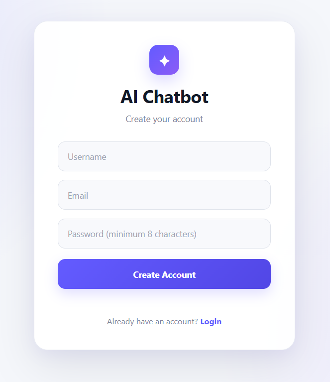
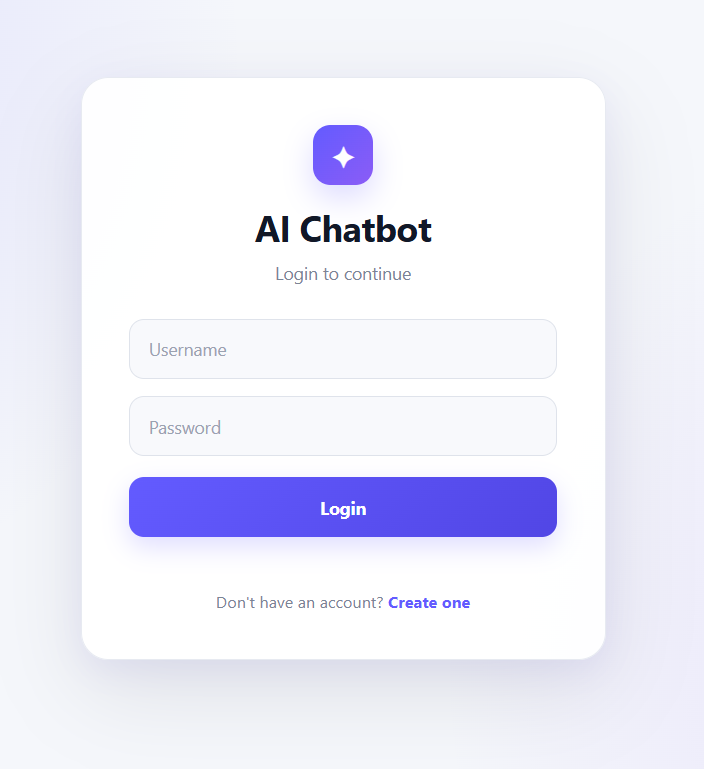
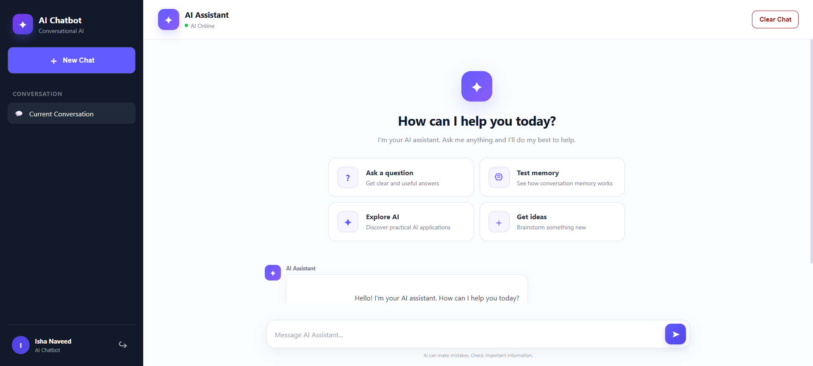
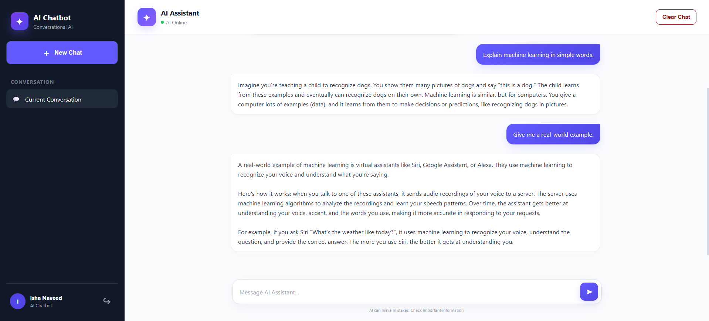
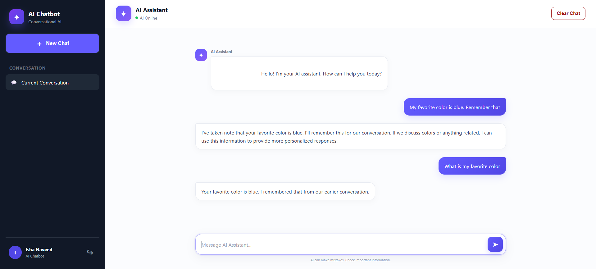
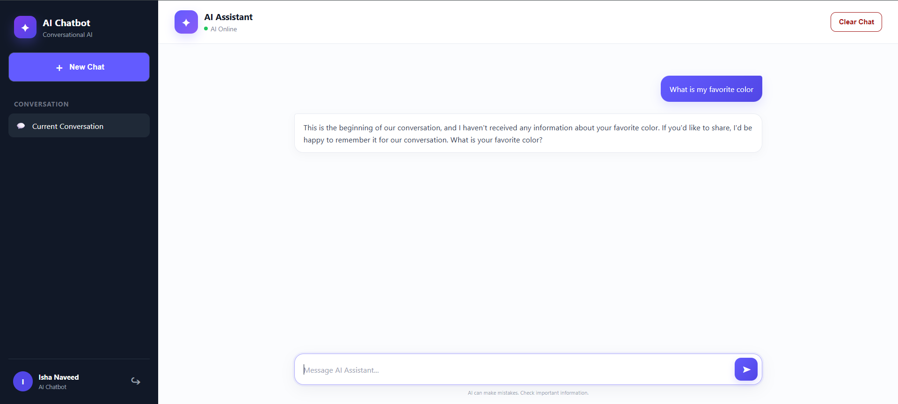

# Custom AI Chatbot with Memory

A conversational AI chatbot built with **FastAPI, JWT authentication, SQLAlchemy, SQLite, Groq LLM, and session-based conversation memory**. The project provides a modern web-based chat interface with authentication, AI conversation, memory, chat controls, and automated testing.

## Features

* User signup and login
* JWT-based authentication
* Secure password hashing with bcrypt
* Groq LLM integration
* Llama 3.3 70B model
* Session-based in-memory conversation memory
* Conversation memory pruning
* New Chat functionality
* Clear Chat functionality
* Logout with conversation memory reset
* Dynamic username and user avatar
* AI online status
* Creator identity awareness
* Modern responsive web chat interface
* REST API
* Swagger/OpenAPI documentation
* SQLite database for user and chat records
* Automated tests
* Error handling for authentication and AI service failures

## Tech Stack

### Backend

* Python 3.12
* FastAPI
* SQLAlchemy
* SQLite
* JWT
* Passlib / bcrypt
* Groq API
* Llama 3.3 70B

### Frontend

* HTML5
* CSS3
* JavaScript

### Testing

* Pytest

## Project Structure

```text
Project-1-Custom-AI-Chatbot/
│
├── backend/
│   └── app/
│       ├── api/
│       │   ├── auth.py
│       │   └── chat.py
│       │
│       ├── core/
│       │   ├── config.py
│       │   ├── dependencies.py
│       │   └── security.py
│       │
│       ├── database/
│       │   ├── connection.py
│       │   └── models.py
│       │
│       ├── repositories/
│       ├── schemas/
│       └── services/
│           ├── ai_client.py
│           ├── auth_service.py
│           ├── chat_service.py
│           └── memory.py
│
├── frontend/
│   ├── index.html
│   ├── login.html
│   ├── signup.html
│   ├── css/
│   │   └── style.css
│   └── js/
│       ├── app.js
│       └── auth.js
│
├── tests/
├── .gitignore
├── README.md
└── requirements.txt
```

## Architecture

The application follows a modular backend architecture:

```text
User
 │
 ▼
Web Frontend
 │
 ▼
FastAPI REST API
 │
 ├── Authentication
 │      └── JWT
 │
 ├── Chat API
 │      ├── Chat Service
 │      ├── Conversation Memory
 │      └── Groq AI Client
 │
 └── Database Layer
        ├── SQLAlchemy
        ├── Repository
        └── SQLite
```

## Authentication

Users can:

1. Create an account.
2. Login with username and password.
3. Receive a JWT access token.
4. Use the token to access protected chat endpoints.
5. Logout and clear the current conversation memory.

Passwords are hashed using bcrypt before being stored.

## Conversation Memory

The chatbot uses **session-based in-memory conversation memory**.

The memory contains:

* User messages
* Assistant responses
* System instructions

The memory is maintained separately for authenticated users during the active application session.

The application intentionally does **not** use a database for conversational memory because the project focuses on demonstrating live-session memory.

Users can start a fresh conversation using **New Chat** or clear the current conversation using **Clear Chat**.

## LLM Integration

The chatbot uses the Groq API with:

```text
Model: llama-3.3-70b-versatile
```

The API key is loaded securely from environment variables.

The AI assistant also has a defined creator identity and can identify **Ishay Naveed** as its creator when asked.

## Web Interface

The frontend provides:

* Login and signup pages
* Modern AI chatbot interface
* User profile display
* Dynamic user avatar
* AI online status
* User and assistant message bubbles
* Conversation memory
* New Chat button
* Clear Chat button
* Logout functionality
* Loading and error states

## Screenshots

The following screenshots demonstrate the main features and user interface of the chatbot.

### 1. User Signup

Users can create a new account using the signup page.



### 2. User Login

Registered users can securely log in to access the chatbot.



### 3. Home / Chat Interface

The main chatbot interface provides a modern conversational experience with user information and chat controls.



### 4. AI Chat

Users can interact with the AI assistant and receive responses through the Groq-powered LLM.



### 5. Conversation Memory

The chatbot maintains conversation context during the active session, allowing the AI to remember previous messages.



### 6. Clear Chat

Users can clear the current conversation and start a fresh interaction.




## API Endpoints

### Authentication

```text
POST /auth/signup
POST /auth/login
```

### Chat

```text
POST /chat
POST /chat/clear
```

### API Documentation

Swagger UI:

```text
http://127.0.0.1:8000/docs
```

## Setup

### 1. Create a virtual environment

```powershell
py -3.12 -m venv .venv
```

### 2. Activate the virtual environment

```powershell
.venv\Scripts\Activate.ps1
```

### 3. Install dependencies

From the project root:

```powershell
pip install -r requirements.txt
```

### 4. Configure environment variables

Create a `.env` file in the project root:

```env
GROQ_API_KEY=your_groq_api_key
JWT_SECRET_KEY=your_secure_secret_key
```

Never commit `.env` or API keys to GitHub.

### 5. Start the backend

```powershell
cd backend
uvicorn app.main:app --reload
```

Backend:

```text
http://127.0.0.1:8000
```

Swagger documentation:

```text
http://127.0.0.1:8000/docs
```

### 6. Open the frontend

Open:

```text
frontend/login.html
```

in a browser.

## Testing

Run the automated test suite from the project root:

```powershell
pytest -v
```

The test suite covers important components including:

* Password hashing and verification
* Conversation memory creation
* Conversation storage
* Memory clearing
* Conversation pruning
* Chat service behavior
* AI failure handling

Manual end-to-end testing was also performed for:

* Signup
* Login
* AI messaging
* Conversation memory
* New Chat
* Clear Chat
* Username display
* User avatar
* Creator identity
* Logout
* Authentication failure handling

## Security

* Passwords are hashed using bcrypt.
* JWT tokens protect authenticated endpoints.
* API credentials are loaded from environment variables.
* `.env` must not be committed.
* Database files should not be committed.
* Protected chat endpoints require authentication.

## Error Handling

The application handles:

* Invalid authentication
* Expired or invalid JWT tokens
* Invalid login credentials
* AI service failures
* Failed chat requests
* Conversation clearing failures

When the AI service is unavailable, the API returns an appropriate service-unavailable response instead of exposing internal implementation details.

## Project Objective

This project demonstrates the development of a complete conversational AI application using:

* An external large language model
* Authentication and authorization
* Session-based conversational memory
* REST APIs
* Database-backed user management
* A modern web interface
* Error handling
* Automated testing

The project was developed as part of the **DecodeLabs Generative AI Internship**.

## Future Improvements

Potential future enhancements include:

* Persistent multi-conversation history
* Chat history sidebar
* Streaming AI responses
* File and document uploads
* Retrieval-Augmented Generation (RAG)
* Voice interaction
* Deployment to a cloud platform
* Advanced conversation management

## Author

**Isha Naveed**

BS Artificial Intelligence Student
Generative AI Intern — DecodeLabs
