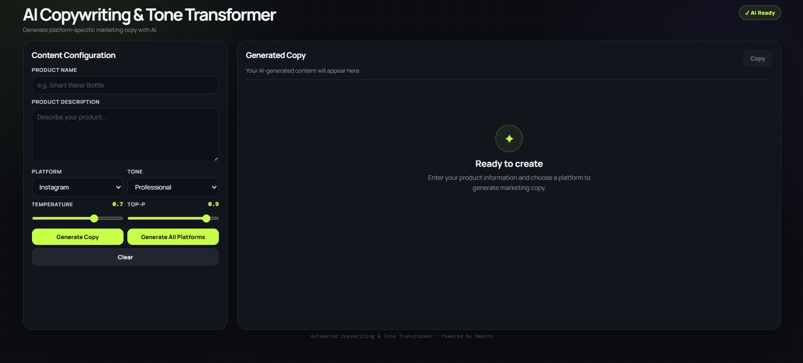
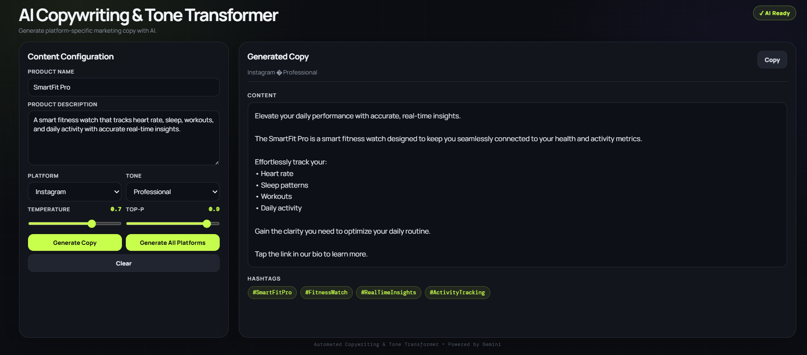
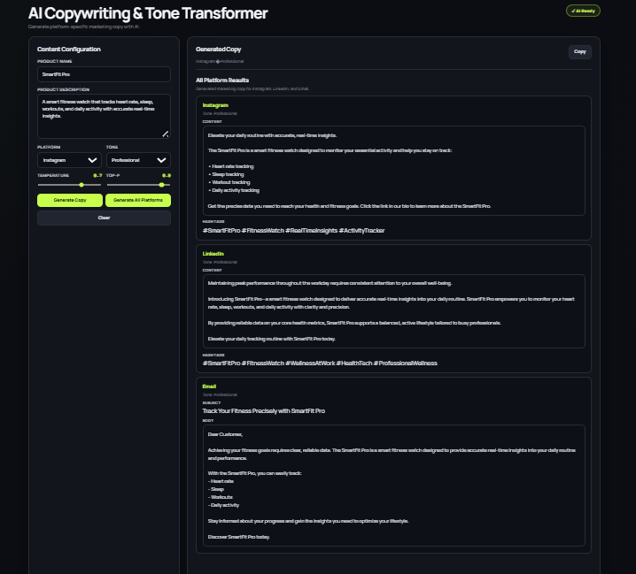

# Automated Copywriting & Tone Transformer

An AI-powered Generative AI application that transforms raw product information into platform-specific marketing copy using Google Gemini.

The application supports multiple social and marketing platforms, configurable writing tones, inference controls, structured output validation, batch generation, and a responsive web interface.

## Features

* AI-powered marketing copy generation
* Platform-specific content generation
* Instagram, LinkedIn, and Email support
* 7 writing tones
* Temperature control
* Top-P control
* Batch generation across supported platforms
* Dynamic prompt compilation
* Platform-specific prompt rules
* Structured Pydantic validation
* Asynchronous generation pipeline
* Retry handling for transient failures
* FastAPI REST API
* Interactive responsive web interface
* OpenAPI API documentation
* Automated unit tests with pytest

## Supported Platforms

| Platform  | Generated Output                          |
| --------- | ----------------------------------------- |
| Instagram | Marketing caption + hashtags              |
| LinkedIn  | Professional marketing content + hashtags |
| Email     | Subject + email body                      |

## Supported Tones

* Professional
* Friendly
* Witty
* Persuasive
* Casual
* Luxury
* Inspirational

## Tech Stack

### Backend

* Python 3.12
* FastAPI
* Pydantic
* Google Gemini API
* Google GenAI SDK
* Uvicorn

### Frontend

* HTML5
* CSS3
* JavaScript
* Responsive CSS layout

### Testing

* Pytest
* Pytest AsyncIO

## Screenshots

### Main Interface



### Single-Platform Generation



### All-Platforms Generation



## Architecture

The project follows a modular architecture that separates API routing, LLM communication, prompt construction, generation pipelines, validation, and frontend presentation.

```text
User
 │
 ▼
Responsive Web Interface
 │
 ▼
FastAPI REST API
 │
 ├── Request Validation
 │
 ├── Prompt Compiler
 │      ├── Master Template
 │      └── Platform Rules
 │
 ├── Generation Service
 │
 ├── Async Pipeline
 │
 ├── Batch Pipeline
 │
 ├── Retry Handler
 │
 ▼
Google Gemini API
 │
 ▼
Structured Generated Output
```

## Project Structure

```text
Project-2-Automated-Copywriting/
│
├── app/
│   ├── api/
│   │   └── routes.py
│   │
│   ├── clients/
│   │   └── llm_client.py
│   │
│   ├── models/
│   │   └── schemas.py
│   │
│   ├── prompts/
│   │   ├── master_template.py
│   │   └── platform_rules.py
│   │
│   ├── services/
│   │   ├── async_pipeline.py
│   │   ├── batch_pipeline.py
│   │   ├── generation_service.py
│   │   ├── prompt_compiler.py
│   │   └── retry.py
│   │
│   ├── utils/
│   │   └── validators.py
│   │
│   ├── config.py
│   └── main.py
│
├── frontend/
│   ├── css/
│   │   └── style.css
│   ├── js/
│   │   └── app.js
│   └── index.html
│
├── tests/
│   ├── test_prompt_compiler.py
│   ├── test_retry.py
│   ├── test_schemas.py
│   ├── integration/
│   └── unit/
│
├── .env.example
├── .gitignore
├── requirements.txt
└── README.md
```

## Installation

### 1. Clone the repository

```bash
git clone <your-repository-url>
cd Project-2-Automated-Copywriting
```

### 2. Create a virtual environment

```bash
python -m venv .venv
```

### 3. Activate the virtual environment

#### Windows PowerShell

```powershell
.\.venv\Scripts\Activate.ps1
```

#### Windows CMD

```cmd
.venv\Scripts\activate
```

### 4. Install dependencies

```bash
pip install -r requirements.txt
```

## Environment Configuration

Create a `.env` file in the project root based on `.env.example`.

```env
GEMINI_API_KEY=your_gemini_api_key
```

The application uses the Google Gemini API through the Google GenAI SDK.

> Never commit your real API key to GitHub.

## Running the Application

Start the FastAPI server from the project root:

```bash
uvicorn app.main:app --reload
```

The API will be available at:

```text
http://127.0.0.1:8000
```

FastAPI automatically provides interactive API documentation at:

```text
http://127.0.0.1:8000/docs
```

Open the frontend:

```text
frontend/index.html
```

in a browser while the FastAPI server is running.

## API Capabilities

The backend provides functionality for:

* Single-platform copy generation
* Batch generation
* Platform-specific prompt construction
* Configurable tone selection
* Temperature and Top-P inference controls
* Structured response validation
* Retry handling

The API documentation can be explored through FastAPI Swagger UI at `/docs`.

## Prompt Engineering

The application uses a modular prompt-engineering approach.

The prompt system separates:

* Master prompt template
* Product information
* Selected platform
* Selected tone
* Platform-specific rules
* Inference configuration

This allows the generated content to follow different formatting and content requirements for Instagram, LinkedIn, and Email.

## Batch Generation

Batch generation allows the application to generate marketing content for multiple supported platforms from a single product input.

Instead of manually generating each platform's content separately, the batch pipeline coordinates generation across the supported platforms and presents the results together in the web interface.

## Testing

The project includes automated tests covering core application components.

Run the test suite with:

```bash
pytest
```

Current test result:

```text
6 passed in 0.71s
```

Tested components include:

* Prompt compilation
* Retry behavior
* Pydantic schemas and validation

## Responsive Interface

The frontend is designed to adapt to different viewport sizes.

### Desktop

* Two-column workspace
* Compact viewport-oriented layout
* Input controls and generated output displayed side-by-side

### Tablet

* Automatically switches to a single-column layout

### Mobile

* Stacked form controls
* Responsive buttons
* Mobile-friendly output sections
* Flexible typography and spacing

## Security Notes

* API keys are stored in environment variables.
* `.env` should never be committed.
* `.env.example` is provided as a configuration template.
* API credentials should be kept private.

## Project Goal

This project demonstrates the practical application of Generative AI for automated marketing-content creation.

It combines:

* Prompt engineering
* LLM API integration
* Structured data validation
* Async processing
* Batch processing
* Retry mechanisms
* REST API development
* Responsive frontend development
* Automated testing

## Project Status

**Completed**

* Backend architecture
* Gemini integration
* Prompt compilation
* Platform-specific rules
* Seven writing tones
* Inference controls
* Single generation
* Batch generation
* Responsive frontend
* Automated tests
* README documentation

## Author

**Isha Naveed**

BS Artificial Intelligence Student
The Islamia University of Bahawalpur

Built as part of the **DecodeLabs Generative AI Internship**.
